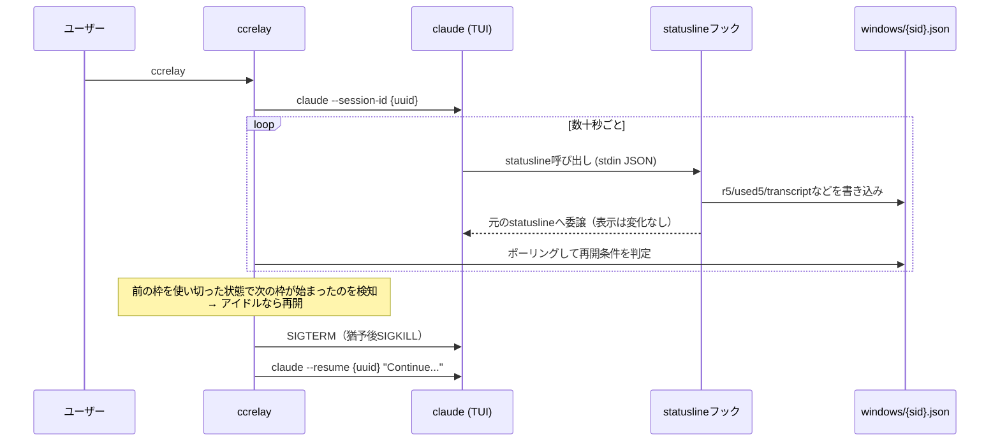

# ccrelay 設計メモ

Claudeの5時間レート制限ウィンドウをまたいでセッションを自動的にリレー（再開）するための簡易ラッパー。
自動操作するのは「再開メッセージ1通」だけ。それ以外のTUI操作は完全に人間が行う。`-p`（非対話モード）は使わない。statuslineフックはインタラクティブTUIでのみ発火し、`-p`では動作しないため、ccrelayが依存する枠情報の取得手段そのものが失われる。

## 確定した設計判断

| 論点 | 採用案 | 理由 |
|---|---|---|
| ウィンドウ情報の取得 | **statusline stdin の `.rate_limits.five_hour.resets_at` / `used_percentage`** | ローカルに他のpullソースは存在しない（調査済み）。API呼び出しは課金枠を使うため不可。 |
| 起動モデル | **ラッパコマンド `ccrelay [-r\|--resume ID] [claude args]`** | ccrelayが端末とsession-id(UUID)を所有し、kill+resumeを確実に行える。完全透過(statuslineのみ)は再開操作にtmuxが必要で、プロンプト状態で不安定。`-r`/`--resume`はclaude本体の同名オプションを横取りし、既存session-idをそのまま採用する（未指定時のみ新規UUIDを採番）。 |
| 再開トリガ | **リアクティブ + 使用量ガード** | 境界で人を落とさない。「新枠開始済み(now>resets_at) かつ 5分以上アイドル かつ 直前枠の使用率が高い」ときだけ kill→resume。 |
| 終了UI状態への耐性 | **kill + `--resume`** | AskUserQuestion/権限プロンプト状態ではキー入力が通らないため、キー注入より再起動が堅牢。 |
| 一時停止の意思表示 | **`[[PAUSED]]` マーカー** | タスク完了、質問への回答待ちなど、ユーザーの発言がないと先に進めない状態を1つのマーカーで表す。再開メッセージ（英語）で指示し、transcript JSONLの最新assistant発言をgrepして検出。追加ファイル不要。 |
| install/uninstallの確認 | **Y/n確認プロンプト（既定Y）** | settings.jsonと状態ディレクトリへの書き込みを伴うため、実際に書き換える前に変更内容（変更前後のcommand）を提示して確認を取る。非対話スキップ用フラグは未提供。 |

## 仕組み

- `~/.claude/settings.json` の `statusLine.command` を `bash ~/.claude/ccrelay/statusline-hook.sh '<元のcommand>'` の形にラップする（元のcommandは第1引数として保持）。`ccrelay install`実行前に変更内容を提示しY/n確認を取る。
- settings.jsonを書き換える直前に、タイムスタンプ付きバックアップ `settings.json.ccrelay-YYYYMMDD-HHMMSS.bak` を残す。
- 生成されたフックは、レート制限情報を書き出した後に**第1引数の元コマンドへそのまま処理を委譲する**ので、statuslineの見た目は変わらない。
- 元に戻す場合は `ccrelay uninstall`。確認後、先頭のラッパーを外して元のcommandに戻し（元のstatuslineが未設定だった場合は`statusLine`ごと削除）、状態ディレクトリ `~/.claude/ccrelay` を削除する。ccrelay自体のスクリプトファイルは削除しない（PATH上の設置場所を一意に特定できないため。手動で`rm`する）。

### 全体の流れ

statuslineフックが5時間枠の情報を書き出し、ccrelay本体（ウォッチャ）がそれをポーリングして再開タイミングを判定する。



### 再開するかどうかの判定（`should_relay`）

次の4条件を**すべて**満たしたときだけ、セッションをkillして`--resume`する。境界で人間の作業を落とさないための安全策。

1. **新しい枠が開いている**（`now > resets_at`）: 記録した枠がすでにリセット済み
2. **使用量ガード**（`used5 >= 90%`）: 直前枠がほぼ枯渇していた場合のみ再開する。すぐ埋まらなかった枠に不要なリレーをしないためのガード（[なぜ90%なのか](#使用量ガードの閾値がなぜ100でないのか) は後述）
3. **アイドル**（transcriptが5分以上未更新）: 作業中のセッションを割り込んで落とさないための条件
4. **一時停止していない**（直近の発言に `[[PAUSED]]` が含まれない）: 再開メッセージで「ユーザーの発言待ちなら `[[PAUSED]]` とだけ発言して」と指示し、transcriptの最新assistant発言から検出する。マーカーを検出した場合はリレーを止め、claudeはそのまま人間の確認用に残す（killしない）

### 使用量ガードの閾値がなぜ100でないのか

条件2は直感に反しやすいので補足する。

「枠がリセットされたのにセッションが止まっている」状況には、本来2通りある。

- **(a) レート制限でブロックされて次の枠を待っていた**。これは再開したい
- **(b) 単にユーザーの入力を待っていた**（タスク完了、質問待ちなど）。これは再開したくない

(b) では枠終了時にトークンが余る（`used5` が低い）ため、使用率で (a) と切り分けられる。ここまでは条件4の `[[PAUSED]]` と同じ狙いだが、`[[PAUSED]]` は再開メッセージで指示されて初めて出るマーカーなので、**人間が手で始めた最初の枠ではまだ出ていない**。その最初の枠で (b) を弾く主役がこの使用量ガード。

ここで「余っている＝入力待ち」なら閾値は100%でよさそうに見える。しかし実際にはそうできない。

- レート制限は「次のリクエストを通すと枠を超える」時点でブロックするため、`used5` が**100に達する前**（例: 97%）に止まることがある
- `used5` は statusline が書き出した**最後のスナップショット**なので、ブロック直前の値を取りこぼし、実際より**低めに見える**ことがある（例: 92%）

100%ちょうどを条件にすると、この2つのケースで**本当に再開すべきセッションを取りこぼす**（再開されないほうが実害が大きい）。逆に閾値を下げすぎると (b) を誤ってリレーする（ただし誤って再開しても、再開メッセージの指示で次のターンに `[[PAUSED]]` を返して自己修正する）。この非対称性から、「実質的に枯渇」を表す余裕をもたせた**90%を既定値**にしている。用途に応じて `CCRELAY_USED_THRESHOLD` で調整できる。

## アイドル検出

セッションの transcript（`~/.claude/projects/<proj>/<sid>.jsonl`）の mtime を見る。更新が止まっていればアイドル。session-id を所有しているのでパスは一意に特定できる（statuslineが `transcript_path` も書き出す。無ければ `find` でフォールバック）。

## コンポーネント

- `ccrelay`: ラッパ本体。session-id解決、リレーループ、ウォッチャ、install/uninstall/status/`--help`、内部テスト用サブコマンドを提供する。
- statusline フック（`ccrelay install` が生成）: stdin JSON から `{sid,r5,r7,used5,transcript,cwd}` を `windows/<sid>.json` に tee し、第1引数で受け取った元のstatuslineコマンドに委譲する。元コマンドは install 時に既存の `statusLine.command` を `printf %q` でクォートして埋め込むため、ユーザーの既存設定は無改変で保持され、uninstall では先頭のラッパーを外すだけで元に戻る。

## 設定（環境変数）

すべて未設定でも動作する。テストでは値を小さくして高速化している。

| 変数 | デフォルト | 意味 |
|---|---|---|
| `CCRELAY_HOME` | `~/.claude/ccrelay` | 状態ファイルの置き場所 |
| `CCRELAY_CLAUDE_BIN` | `claude` | 実行する claude コマンド |
| `CCRELAY_IDLE_SEC` | `300` | この秒数transcriptが更新されなければアイドル扱い |
| `CCRELAY_USED_THRESHOLD` | `90` | 直前枠の使用率がこの値以上のときだけ再開（[100でない理由](#使用量ガードの閾値がなぜ100でないのか)） |
| `CCRELAY_POLL_SEC` | `30` | ウォッチャのポーリング間隔 |
| `CCRELAY_GRACE_SEC` | `5` | SIGTERM後、SIGKILLするまでの猶予秒数 |
| `CCRELAY_RESUME_MESSAGE` | （既定の再開メッセージ、英語） | `--resume`時にClaudeへ送るメッセージ |
| `CCRELAY_SETTINGS` | `~/.claude/settings.json` | 書き換え対象のsettings.json |

## 状態ディレクトリ（`~/.claude/ccrelay/`）

```
~/.claude/ccrelay/
├── statusline-hook.sh     # ccrelay install が生成するフック本体
├── windows/<sid>.json     # statuslineフックが書き出す枠情報（r5, used5, transcriptなど）
└── state/<sid>/
    ├── pid                # 起動したclaudeのPID
    ├── relay              # このセッションで再開が発生した目印
    └── paused             # [[PAUSED]] を検出した目印
```

`ccrelay uninstall` はこのディレクトリごと削除する。

## カット候補（複雑化したら外す）

- 使用量ガード（`USED_THRESHOLD`）を 0 にすればリアクティブのみに退化。

## カット済み

- ラベル機能（`labels.json`によるラベル→UUID管理）。claude本体が終了時に`--resume`コマンドを提示するため、ユーザーがそれをそのまま`-r`に渡せば十分で、ccrelay側で別の識別子を持つ意味が薄いと判断。
- install/uninstallの非対話スキップフラグ（`-y/--yes`）。現状は対話的な確認のみで運用し、必要になった時点で追加する。
